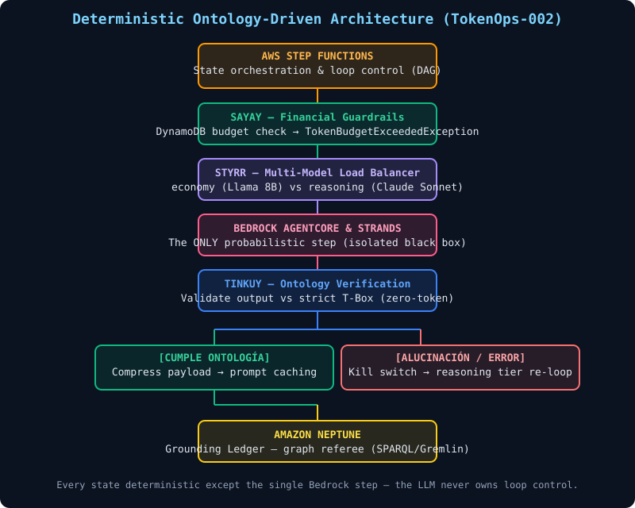

# Deterministic Ontology-Driven AWS — Reference Implementation



A runnable AWS reference for **TokenOps**: bound the probabilistic LLM inside a
single step of a deterministic Step Functions DAG. Everything around the model is
traditional, testable infrastructure.

> **The principle:** never let the LLM decide when to iterate (that's how infinite
> loops and surprise bills happen). Step Functions owns loop control; the agent
> runs one step and returns control.

```
Step Functions (DAG) → sayay-guard-interceptor → styrr-llm-router
                     → bedrock-strands-runtime → tinkuy-neptune-validator
                     → Neptune (Grounding Ledger)
```

## Components

| Component | Role | Exception on failure |
|-----------|------|----------------------|
| **Step Functions** | State machine & loop control — deterministic | — |
| **sayay-guard-interceptor** | Financial guardrail: reads DynamoDB budget, allow/warn/degrade/block | `TokenBudgetExceededException` → Kill Switch |
| **styrr-llm-router** | Multi-model load balancer: economy (Llama 8B) vs reasoning (Claude Sonnet) | — |
| **bedrock-strands-runtime** | The single probabilistic step (Bedrock AgentCore & Strands) | — |
| **tinkuy-neptune-validator** | Ontology verification vs strict T-Box (`@carloscortezcloud/tinkuy-agent` `ontology` module) | `OntologyViolationException` → escalate to reasoning tier |

## Directory layout

```
deterministic-ontology-aws/
├── state-machine.asl.json            # ASL reference spec (validated, templated ARNs)
├── architecture.svg                  # Rendered architecture diagram
├── README.md
├── lambdas/
│   ├── sayay-guard-interceptor/      # + test
│   ├── styrr-llm-router/             # + test
│   └── tinkuy-neptune-validator/     # + test (bundles tokenops_ontology.yaml)
└── cdk/
    └── src/index.ts                  # CDK stack (programmatic state machine, real ARNs)
```

## Local development

The three lambdas are pnpm workspace packages (Tinkuy Labs monorepo). Each has its
own `vitest` test suite:

```bash
pnpm install
pnpm --filter sayay-guard-interceptor test
pnpm --filter styrr-llm-router test
pnpm --filter tinkuy-neptune-validator test
```

Validate the ASL without AWS credentials:

```bash
npx asl-validator --json-path state-machine.asl.json
```

## Deploy (CDK)

```bash
cd cdk
export OPENROUTER_API_KEY=sk-...   # optional — fallback is direct Bedrock
pnpm build
cdk deploy
```

The stack provisions:
- `BudgetTable` (DynamoDB, pay-per-request) — sayay storage
- Three Lambda functions from the blueprints
- Neptune security group (port 8182) — bring your own cluster
- `DeterministicOntologyMachine` (Step Functions) wired to the real Lambda ARNs

> The `.asl.json` is the human-readable spec with templated ARNs. The CDK stack
> constructs the state machine **programmatically** from the real resources so
> `cdk deploy` works out of the box — no placeholder substitution needed.

### Kill switch flow

```
EvaluateFinancialGuardrail ──(TokenBudgetExceededException)──▶ FinancialKillSwitchTriggered (Fail)
ValidateOntologyWithTinkuy ──(OntologyViolationException)──▶ HandleHallucinationError ──▶ re-loop
```

Both exception names in the code match the `ErrorEquals` matchers in the ASL —
no extra configuration required.

## What makes this FinOps-safe

- **Mathematically bounded cost:** every lifecycle is budgeted by sayay-guard before
  inference; over-budget strands hit the Fail state — no retries, no bill.
- **Zero-token validation:** the ontology check runs in pure CPU/memory via the
  Tinkuy `ontology` module, replacing LLM-as-a-judge.
- **No infinite loops:** Step Functions (not the agent) controls iteration.
- **Grounding Ledger:** Neptune is the referee; structurally corrupt output is
  rejected before it touches your data.

## Not in scope (per SoW)

- Provisioning a real Neptune cluster (guide only — bring your own)
- Production IAM hardening (example policies only)
- Cross-region inference routing (future Strands feature)
