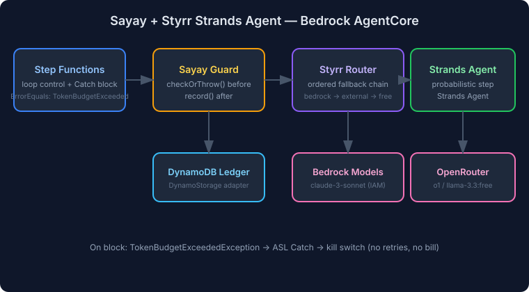

# Sayay + Styrr Strands Agent — Bedrock AgentCore Example



The probabilistic step of an AgentCore application: a **Strands agent** whose LLM
calls are routed by **Styrr** across an ordered cross-provider chain and financially
guarded by **Sayay** before and after every inference.

> **The budget story:** Sayay reads the ledger → decides allow/warn/degrade/block.
> On block, `checkOrThrow()` raises the native `TokenBudgetExceededException` so the
> Step Functions Catch block (`ErrorEquals`) halts the workflow. Usage from the
> completed strand is recorded back to the ledger.

## Fallback chain

| Order | Model | Provider | Cost tier | When |
|-------|-------|----------|-----------|------|
| 1 | `anthropic.claude-3-sonnet` | Bedrock | `bedrock` | default — fast, in-VPC (IAM auth) |
| 2 | `openai/o1` | OpenRouter | `external` | Bedrock failed / max quality |
| 3 | `meta-llama/llama-3.3-70b:free` | OpenRouter | `free` | last resort — zero cost |

Styrr fails over on 429/5xx/timeouts, fail-fast on 401/400. Bedrock is lazy-imported —
the package stays zero-dependency.

## Run

```bash
pnpm install
OPENROUTER_API_KEY=sk-... npx tsx src/index.mjs "your prompt"
```

The Bedrock leg authenticates via your Lambda execution role (or local `~/.aws/credentials`).

## Lambda handler shape (AgentCore)

```typescript
import { handler } from './handler.js';

// Invoked from Step Functions / AgentCore
const result = await handler(
  { prompt: 'Summarize this ticket', userId: 'user-42' },
  { BUDGET_TABLE: 'sayay-ledger', DAILY_USD: '5' },
);
// { completion, model, costTier: 'bedrock', tokens, budgetAction: 'allow' }
```

- **Storage:** `DynamoStorage` when `BUDGET_TABLE` is set (survives warm starts),
  `MemoryStorage` otherwise (tests/local).
- **Budget:** `checkOrThrow()` → `TokenBudgetExceededException` on block (ASL Catch → kill switch).
- **Usage:** `guard.record()` after the strand, using estimated USD from token usage.

## Test

```bash
pnpm --filter sayay-styrr-agentcore test
```

The runner is injectable so tests stub the Strands agent (no network calls).
